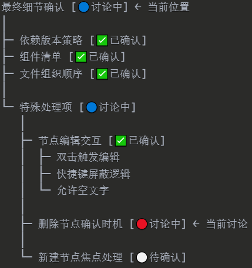

web端（多文件）

使用gemini构建：https://aistudio.google.com/apps/drive/1HvZqNv9hRVdaVh1N7hyUZ5l2zhzstrDV?showPreview=true&showAssistant=true

使用临时代理加速（windows cmd）：
set HTTP_PROXY=http://127.0.0.1:7890
set HTTPS_PROXY=http://127.0.0.1:7890

使用git提交：
git clone https://github.com/DY-code/flow.git
git add .
git commit -m "your_comment"
git push origin main

----

待改进：

- 逻辑链/思维流样式切换：添加思维导图样式（预览即可）
- 提供不同的状态组合，以适应不同的任务场景

工作流：待进行/进行中/已完成/暂时搁置

逻辑链：

（节点模板）问题/情景，原因/假设，目标，解决方案/行动，结果，下一步计划

中性节点

（验证假设与猜想，debug）待验证/已证实/已证伪

- 考虑实现pwa

- 添加功能：使用tab+键缩进父节点，子节点同时跟随缩进

- 黑暗主题下思维流区和其他编辑区颜色不一致

- 支持（基于git的）版本控制与备份
- 探索更便捷的启动方式，暂不考虑部署到github.io

- markdown进阶功能支持（比如...）
- 优化markdown预览模式下的字体（使用typora风格）
- （可能需要依赖本地文件访问）基于项目文件夹，建立本地文件链接
- （暂不考虑）添加同时开启多个页面，管理不同项目

---

2.9：
- 改进：优化markdown预览效果，缩小预览时的标题字体，和已有风格协调。给预览模式再添加一个简略的浮动大纲，显示在预览界面的右侧
- 改进：在“版本历史”中保存当前版本时，将当前版本对应的json文件备份到浏览器下载目录，命名格式：项目名+当前时间

2.8：
- 改进：改名为flow

2.6：
- 改进：聚焦模式下，将聚焦节点的文本添加到全局文本区（提供一个切换按钮即可）
- 改进：在“版本历史”中保存当前版本时，将当前版本对应的json文件备份到浏览器下载目录
- 改进：提供搁置节点的隐藏选项（光标移动到附近才显示）
- 修复bug：当天第一次启动时不能稳定加载

---

2.2：

- 修复bug：引入大段markdown文本时，选中内容和原文本错位
- 新增“待继续”状态，和已有的“暂时搁置”区分开

---

1.31：

- 修改项目标题文本框，使文本框长度自适应项目标题，确保项目标题旁渲染的状态圆点能紧靠标题
- 编辑器优化：执行撤销操作后光标位置乱跳（多次尝试未果，暂时放弃）
- 改进：加载项目时，默认使用分隔视图（全部默认使用分隔视图）
- 修复bug：全局文本区开头部分的内容被自动删除
- 修复bug：加载项目后，标题旁的状态圆点错误显示橙色
- 修复bug：选中带样式文本时，渲染异常

- 修复bug：全局文本框编辑文本时（增加或删除字符），光标自动跳转到文本末尾

---

1.30：

- 修复bug：思维流中的节点名称和右栏节点名称没有实时同步
- 改进：添加导出文件到指定路径的功能（用户选择）

- 编辑器优化：全局文本区换行不美观

- 编辑器优化：样式符号与光标不对齐

---

1.29：

修复bug：在某些节点的右栏文本框内修改内容并撤销（ctrl+z）时，文本被全部删除

- 支持针对指定节点的右栏单独导出markdown文件，导出文件名使用对应的节点名称+修改时间；为指定节点导入markdown文件，在该节点目前已有文本的后面（换行）添加导入的markdown文本内容（在右栏标题区右侧提供针对该节点的导入/导出按键）

- 支持基于特定节点新建项目，新建项目名默认为该节点的名称。基于指定节点新建项目时，新建项目的项目名称继承该节点的名称，逻辑链&思维流则继承该节点的子节点（该节点作为根节点，不用展示），该节点原本对应的文本内容提升为全局文本。

修复bug：在新建/导入项目时，全局文本区没有同步更新，而是需要手动刷新标签页

- 支持基于特定节点进入专注模式（将指定节点暂时提升为根节点，不属于该节点的其他节点隐藏）

- 提供基本的typora样式快捷键支持（ctrl+b-加粗“**文本**”，ctrl+u-下划线<u>文本</u>，ctrl+i-斜体*文本*），并尝试实现非预览状态下渲染（尽量）

修复bug：在某些节点的右栏编辑器中按ctrl+z，文本会全部清空

- 导出文件名使用项目名称+修改时间
- 默认（包括新建项目后）使用白色主题

---

1.24：

- 改进：支持在没有节点说明的情况下提供隐藏选项

- 改进：在项目名旁边添加更新未保存（导出）提示，在存在未保存（导出）内容时关闭标签页，强制弹出提示并确认

- 改进：提供隐藏右栏（子界面）选项

- 改进：节点状态图标放在节点名称左边，始终显示状态图标，而不是鼠标移上去才显示；右栏在标题右侧同步展示节点状态图标和状态文本
- 改进：节点编辑方式

新建节点自动进入编辑模式

shift+enter，在节点上方创建新节点

ctrl+enter，进入编辑模式

- 改进：改进逻辑链/思维流样式，要有清晰的链状结构

无序列表样式：按照markdown无序列表形式编辑和展示，类似于在typora中编辑markdown文本的效果

节点前的圆点显示方式：完全展开的节点（包括没有子节点的节点）使用空心圆点，未完全展开的节点使用实心圆点

连接线样式：

取消vscode风格的缩进对齐线

同一个父节点的下一层级的最后一个子节点使用L型连接线，无分支；其他节点使用T型连接线

父节点展开后，应该从父节点的圆点向下引出一条竖线，接到父节点下第一个子节点的T型连接线上

改进节点的选中样式：高亮节点文本

---

1.23：

- 添加特性：markdown基本功能支持（使用预览）
- 修复：解决了编辑节点名称和注释部分时，光标乱跳和自动切换的问题
- 添加特性：在右栏中明确标注“标题”和“说明”内容对应的位置
- 添加特性：提供隐藏主界面的选项
- 添加特性：大纲树中，节点说明统一放在节点名后（使用不同的颜色和字号进行区别），并提供隐藏选项
- 添加特性：添加项目名称，在界面上编辑和展示项目名称
- 修复：解决全局文本区和右栏中提示文字自动变为真实可编辑文字的问题（应该在输入文字后隐藏提示文字）
- 改进：改进大纲树样式，要有清晰的链状结构
- 改进：预览模式仅针对正文
- 改进：改名为flow
- 改进：在大纲树/右栏中，双击节点名称/标题/说明，以进入编辑模式，默认不可编辑，单击仅选中
- 添加特性：单击选中节点（非编辑模式）时，支持按delete删除
- 添加特性：在节点对应的右栏标题区右侧记录并展示最新修改时间
- 修复：导出选项使用不方便（光标离开export按钮区域后，选项立即自动消失无法点击选择）
- 添加特性：在界面上方中间的空白位置固定展示标语“简化，细分，缩短，放慢。”
- 添加特性：添加新建项目功能（将当前页面恢复为原始空白界面，需要用户确认后才新建）
- 添加特性：支持手动拖动节点以设置节点位置和层级
- 添加特性：添加黑白主题切换功能

